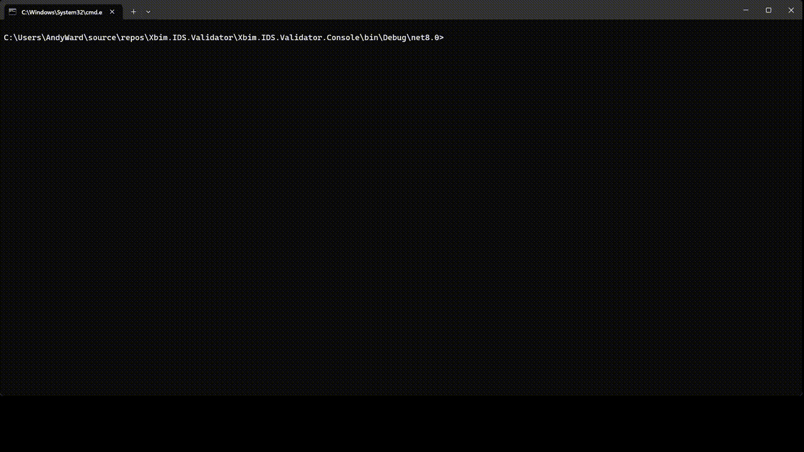
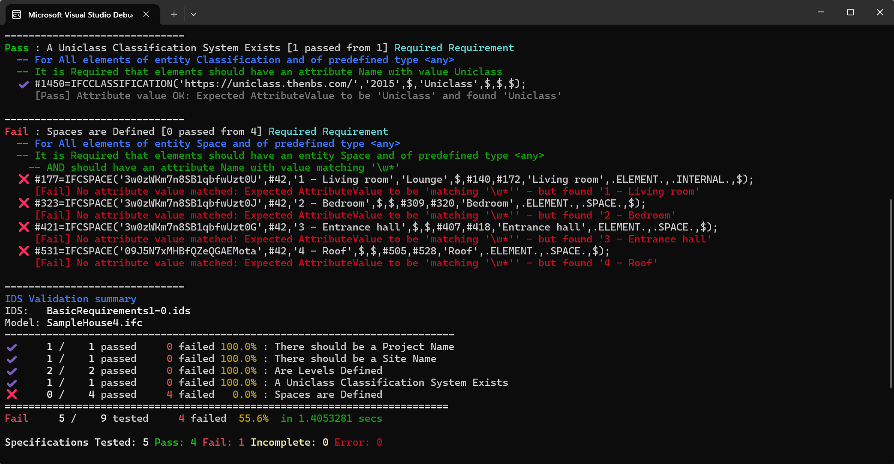

# Xbim.IDS.Validator


Xbim.IDS.Validator is a .net (core & framework) library tht validates IFC models against the latest 
BuildingSMART [Information Delivery Specification](https://github.com/buildingSMART/IDS/blob/master/Documentation/README.md) (IDS) standard.

Powered by xbim Tookit, this library can be used to translate IDS files into an executable specification, 
which can be run against any IFC2x3, IFC4 or IFC4.3 model and provide a detailed breakdown of the results.
It supports the latest full IDS specification and should fully support cloud and desktop applications across platforms.

An experimental extension adds support for validating COBie using IDS. See the [Readme in Xbim.IDS.Validator.Extensions.COBie](Xbim.IDS.Validator.Extensions.COBie) 
for more info.

## How do I install it?

```
dotnet add package Xbim.IDS.Validator.Core
```

## How do I use it?

Building the solution is easy, which includes a fully functional Console application in the __Xbim.IDS.Validator.Console__ project.




To integrate in your own application is also simple. Given an IDS file such as [example.ids](Xbim.IDS.Validator.Core.Tests/TestModels/Example.ids) and an input IFC such as 
[SampleHouse4.ifc](Xbim.IDS.Validator.Core.Tests/TestModels/SampleHouse4.ifc), a basic C# implementation might look like:


```csharp

// during application startup/bootstrap:

IServiceCollection serviceCollection = new ServiceCollection();

serviceCollection.AddIdsValidation();

// Build service provider if not using DI 
var provider = serviceCollection.BuildServiceProvider();

// Get IdsModelValidator from an IServiceProvider / or inject to your service
var idsValidator = provider.GetRequiredService<IIdsModelValidator>();

// Open a model

IModel model = IfcStore.Open("SampleFile.ifc"); // Or any other IModel implementation in place of IfcStore (including optionally a COBieModel)

// optionally you can over-ride some behaviours
var options = new VerificationOptions
{
    OutputFullEntity = true,            // Returns the full IFC entity in results, not just key
    PerformInPlaceSchemaUpgrade = true, // Update old IDS schemas to latest version
    PermittedIdsAuditStatuses = VerificationOptions.Relaxed,    // Silently ignore some IDS schema errors - just log the fault
            
    // IncludeSubtypes = true           // Include derived IFC Entity types in Selection
    // AllowDerivedAttributes = true,   // Allow Derived attributes to be tested.
};

// Invoke the validation checking asynchronously. Also supports cancellation and async progress updating.
ValidationOutcome outcome = await idsValidator.ValidateAgainstIdsAsync(model, "example.ids", logger, verificationOptions: options);

// Present the results
foreach (ValidationRequirement requirement in outcome.ExecutedRequirements)
{
    // ApplicableResults contains details of the applicable IFC entities tested
    var entitiesTested = requirement.ApplicableResults.Count();
    var entitiesPassed = requirement.ApplicableResults.Count(e => e.ValidationStatus == ValidationStatus.Pass);
    Console.WriteLine("[{0,-8}] : [{1}/{2}] met {3} specification '{4}' ",
        requirement.Status,
        entitiesPassed, entitiesTested,
        requirement.Specification.Cardinality.Description,
        requirement.Specification.Name
        );

    // Detail the failure reasons against applicable entities.

    foreach(var entity in requirement.ApplicableResults.Where(e => e.ValidationStatus != ValidationStatus.Pass))
    {
        Console.WriteLine(" Failed Entity: {0}", entity.FullEntity);
        foreach(var failure in entity.Messages)
        {
            // Reasons for failure
            Console.WriteLine("   {0}", failure);
        }
    }
}
```



## How much of the IDS spec does this support?

This is a comprehensive implementation of the latest IDS v0.97 standard, passing all current [TestCases](https://github.com/buildingSMART/IDS/blob/master/Documentation/testcases/scripts.md) 
(with one esoteric edge-case not implemented). 
This library has been tested at scale with real-world models. It also supports some useful extensions that can be enabled through runtime options.

It currently supports:
- Applicability and Requirements of the following
    - [x] Entities & Predefined Types
    - [x] Attributes
        - With optional extension to support devived Attributes 
    - [x] Classifications
        - Includes Classification hierarchies/ancestry
        - Includes inheriting/over-riding from Type
    - [x] Properties
        - Includes inheriting from Type
        - Support for all IfcSimpleProperty implementations
        - Support for IfcElementQuantities
        - Support for Unit conversion
        - Support for 1e6 Floating Point precision tolerances
    - [x] Materials
    - [x] PartOf
    - [x] Combinations of all Facet types and Cardinalities
    - [ ] Xbim.IDS custom facet extensions (Document, IfcRelation)
- [Complex Restrictions](https://github.com/buildingSMART/IDS/blob/master/Documentation/restrictions.md):
    - [x] Enumerations
    - [x] Patterns (Regex)
    - [x] Bounds/Ranges
    - [x] Structure (Min/Max length)
- Restrictions can be used in both Applicability filtering and Requirements verification
- Reading of IDS 
    - in v0.9-0.9.7 Schema in BuildingSmart Xml formats
    - in v0.9.7 IDS JSON formats (XIDS proprietary)
- Required, Prohibited and Optional Facets
- Cardinality of Specification (Expected, Prohibited, Optional)
- Support for validating models in following IFC Schemas
    - [x] IFC2x3
    - [x] IFC4 schemas
    - [x] IFC4x3-ADD2
    - [x] COBie24 (Experimental - using an extension module: **Xbim.IDS.Validator.Extensions.COBie** and proprietary entity types)
- Support for validating IDS schema validity using ids-lib
- Support for upgrading older IDS schemas to latest Xml Schema
- Custom Extensions (See [xbimEndToEnd TestCases](Xbim.IDS.Validator.Core.Tests/TestCases/xbimEndToEnd.cs) for example usage)
    - [x] Case Insensitivity testing
    - [x] Special case handling of Wild-carded PropertySet names [See IDS#189](https://github.com/buildingSMART/IDS/issues/189)
    - [x] Optional Support for Ifc Type Inheritance
    - [x] Optional Support for querying/verifying Derived Properties (Mostly for COBie)
    - [x] Optional support for running IDS against COBie Spreadsheets (using Xbim.COBieExpress extensions)
    - [x] Support for use of IFC4+ schema items on Ifc2x3 models - e.g. to support IfcAirTerminal queries via an inferred IfcAirTerminalType definition [See IDS#116](https://github.com/buildingSMART/IDS/issues/116)  [Usage Example](Xbim.IDS.Validator.Core.Tests/TestCases/xbim/pass-ifc2x3-air_terminal_edge_case.ids)

The library has been tested against the [IDS test suite](https://github.com/buildingSMART/IDS/blob/master/Documentation/developer-guide.md#checking-ids-against-ifc)

Currently only one minor test-case is unsupported. (See PropertySet skipped unit-test).

## To-do list

- [ ] Support for Xbim.XIDS extensions (Documents etc)
- [ ] Testing Pre-defined Properties. e.g. IFCDOORPANELPROPERTIES.PanelOperation
- [ ] Review support of latest PartOf relations in 0.96/0.97
- [ ] Further COBie specific enhancements (Attributes checking, Classification etc)
- [ ] Refactoring to further unify selection and verification logic for consistency

## License
This library is made available by xbim Ltd under the GNU Affero General Public License v3. **Please note** this is different to the Open Source license used by other 
libraries in the xbim Toolkit (CDDL), and means that, while you are free to use this software for evaluation, personal, and non-commercial use, it is not compatible for use
use in 'proprietary' (closed-source) commercial software. 

__If you are a developer wishing to use this library in commercial software please contact sales@xbim.net to discuss a commercial license, or contact @andyward on github.__